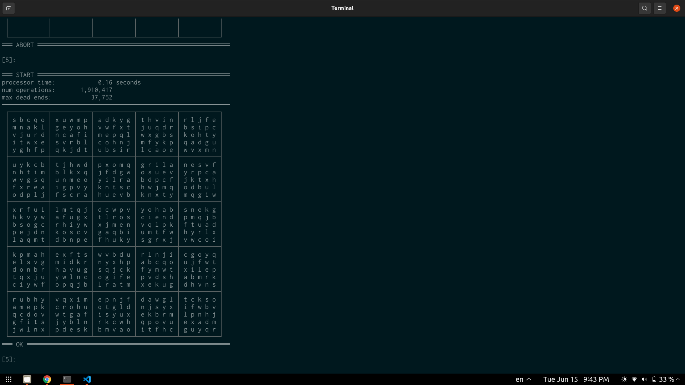
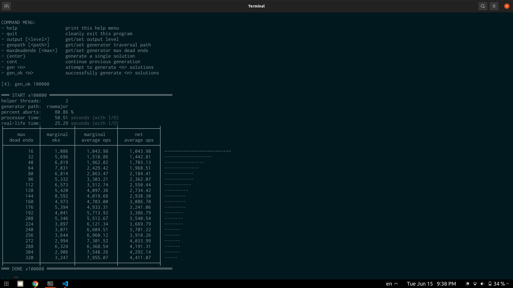

# C++ Implementation

## How to Run It

Note: If building for windows, make sure you have mingw-w64 installed, and set the [`WINDOWS_ANSI`](./src/buildflag.hpp) build flag to true. This project was originally developed using mingw-w64. Pull requests are appreciated to fix any issues encountered when building for other systems.

```shell
cd src
./build.sh
./main
```

Upon starting the program, you will enter the REPL and be greeted with information about defaulted arguments to the main function, and a menu of commands and their functions.

Below is a screenshot of what you might see after running `./solvent_cli 5` and running a couple generation attempts. The solver is tuned to give up in a way that optimizes throughput when generating batches of solutions, so you may notice many attempts giving up for size 5 before getting one that works.



Below is a screenshot of what you might see after running `./solvent_cli 4`, then `gen_ok 100000` to generate solutions until 100000 have completed successfully.



## The Code

This is not an explanation of the algorithm! If you would like that, you can see it for yourself using [the web-visualizer](https://david-fong.github.io/Sudoku-JS/) (though it may not be very up to date).

|   | |
|:-:|-|
| Separation of Concerns | The solver-functioning is its own class, encapsulated as a field of the REPL, which is its own, separate class. The REPL also separates token matching (for sub-commands) from token consumption, so it can be cleanly interfaced with via both strings and token enums. |
| Space Efficiency | The solver class uses a grid-size template parameter to conditionally specify the byte-width of its members. You can find those type definitions in [src/solvent_lib/size.hpp](./src/solvent_lib/size.hpp). This theoretically allows for less "wasted space" in the cache. In practice, since it uses the "fast" uint variants, they tend to become 64bit uints, which still ends up being faster despite using more cache. |
| Effort-Params | The solver gives up generation attempts when it has judged it to take "too long". These have been tuned to optimize machine-agnostic performance. |
| Multi-threading | It makes use of the CPU's cores. That's all. you can find the related code in the ["batch" files](./src/solvent_lib/batch/mod.hpp). |
| Compiler Optimizations | This program uses [GCC builtins](https://gcc.gnu.org/onlinedocs/gcc/Other-Builtins.html) such as `ctz`, `popcount`, `__builtin_expect`, and other language features like `[[gnu::const]]` and `[[gnu::hot]]`. I also took a dip into program profiling and related optimization possibilities, but not enough to get any noticeable benefit from it. |
